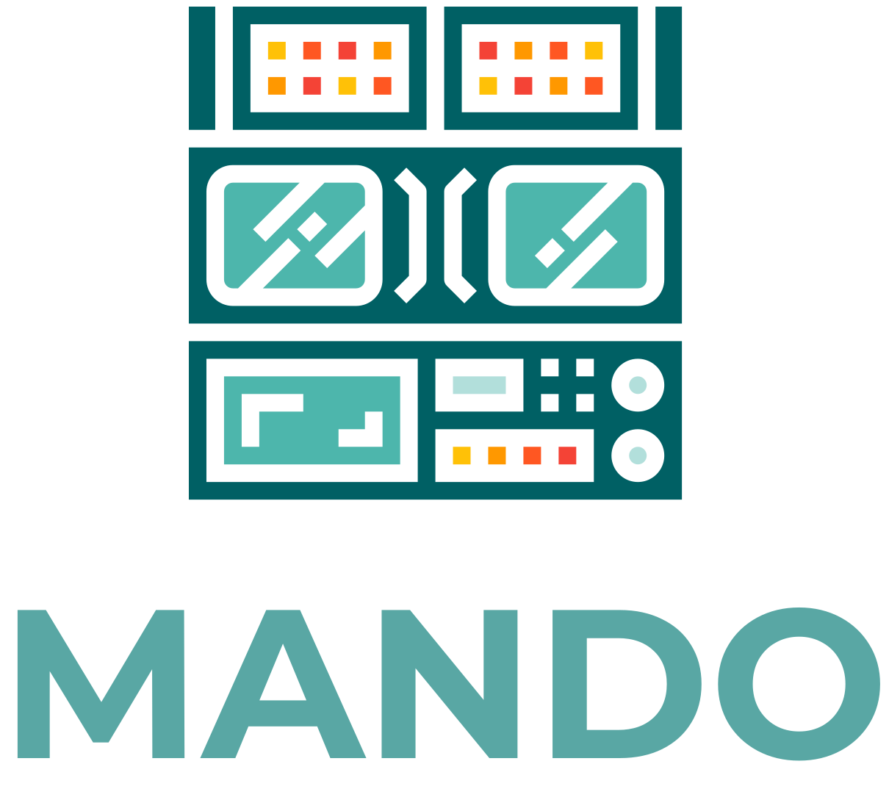

Mando is an OBS Studio remote meant for desktop browsers. It's main use-case is for producers or technical directors who are running the stream from off-screen.

> Mando should be considered alpha software! This is an in-progress project and, while basic functionality works as expected, Mando should probably not (yet) be used for any production you don't want to have go terribly wrong.

